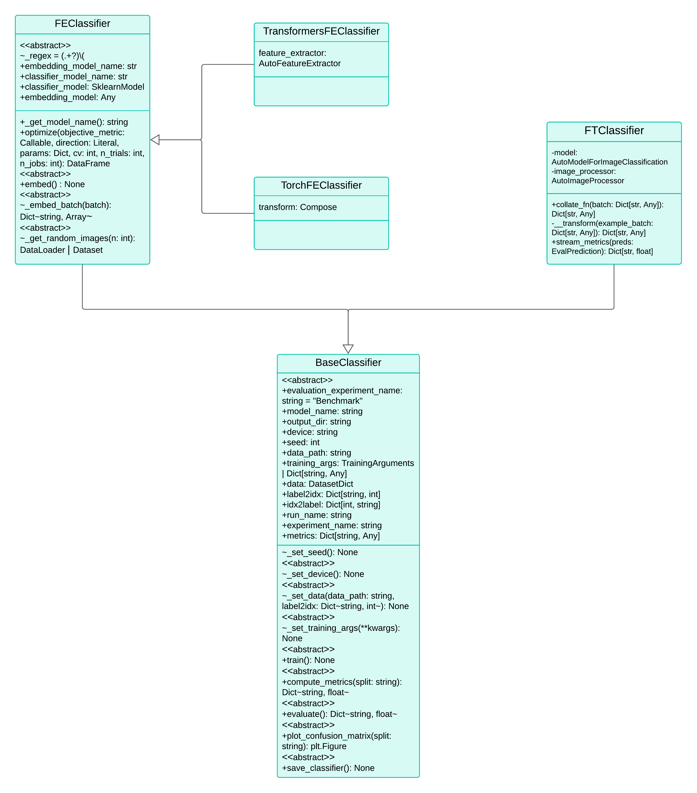

# Training Package

The Training package is a comprehensive module designed specifically for the training of machine learning models within our project. This package is the cornerstone for developing robust, efficient, and high-performing models.

## Overview

The Training package encompasses all essential classes required for model training, structured to support various training methodologies. At the core is the `BaseClassifier`, an abstract class that lays the foundational attributes and methods from which all specific training classifiers inherit.

### Abstract Class Hierarchy

- **`BaseClassifier`**: The abstract base class for all classifiers.
  - **`FEClassifier`**: The abstract class for Feature Extraction training.
  - **`FTClassifier`**: The abstract class for Fine Tuning training.
  - **`PTClassifier`**: The abstract class for Pre-Training.

These classifiers are tailored to distinct training approaches:
- **Feature Extraction (FE)**: Extract the embeddings for each image in the dataset and then train a 'head' classifier with these vectors.
- **Fine Tuning (FT)**: Involves more in-depth adjustments to the pre-trained models to better suit our needs.
- **Pre-Training (PT)**: Entails training models from scratch.

### Integration with MLflow

All classes in this package are integrated with MLflow, providing a seamless and intuitive way to track experiments, log parameters, and evaluate model performance. MLflow facilitates a structured environment to compare models and techniques effectively.

#### MLflow Structure

  

- **FE, FT, PT Sections**: Each training technique has its dedicated section within MLflow to organize and monitor the training processes distinctly.
- **Benchmark Section**: Contains metrics and evaluations for each model on the test set, allowing for a comprehensive comparison of techniques.

## Getting Started

⚠️ To ensure the package functions correctly, it is crucial to initiate training processes from the project's root directory, especially when running locally. This ensures all paths and dependencies are correctly resolved.

## Class Diagram

